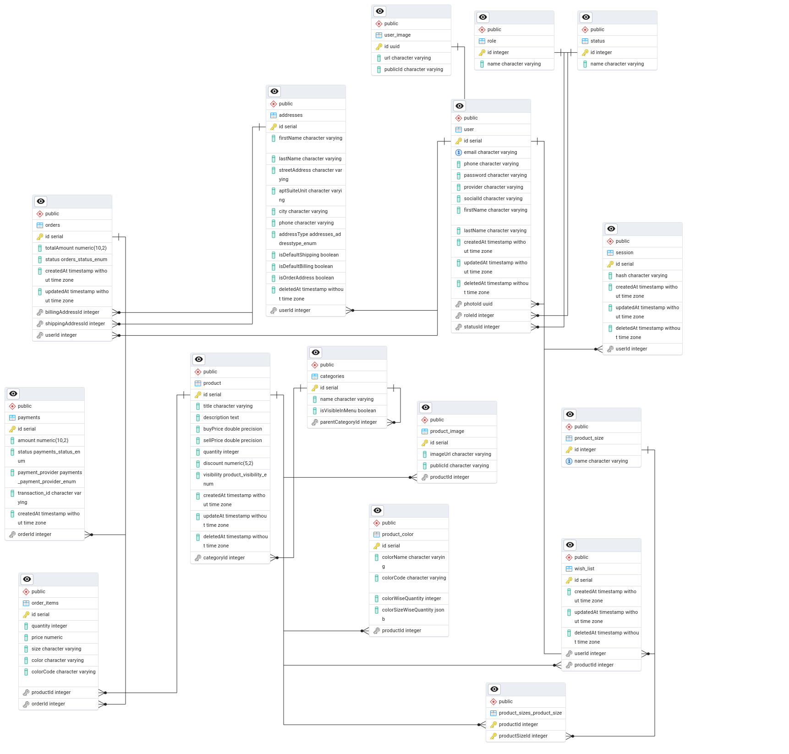

# E-Commerce Portfolio Project

## Overview

This repository contains a complete e-commerce application with three main projects:

1. **Backend**: A NestJS-based API server built with Hexagonal architecture.
2. **Admin Dashboard**: A Next.js admin client for managing the platform.
3. **Customer Client**: A Next.js customer-facing client for shopping.

### Key Features

#### Authentication

- User login with email/password, Google, and Facebook.
- JWT-based authentication with role-based access control for admin and customers.
- Implement "Forgot Password" functionality with a reset link containing a JWT token for password reset.

#### Customer Features

- Wishlist and cart management.
- Checkout with Stripe payment gateway integration.
- Advanced product filtering by price range, size, and category.
- Infinite scrolling on the product list page using TanStack Query, with caching for filtered data.
- Reset password functionality with secure token generation.

#### Admin Features

- Manage products, users, and categories with full CRUD operations.
- Order management, including status updates and tracking.
- Detailed statistics:
  - Total revenue, orders, and products.
  - Active customers.
  - Monthly revenue chart.
  - Best-selling products.

#### Other Features

- Stripe webhook integration to handle payment status updates.
- Pagination and sorting for product listing.

## Repository Structure

```plaintext
root
├── backend
│   └── README.md
├── admin-client
│   └── README.md
├── customer-client
│   └── README.md
```

Each subproject contains its own detailed README file with specific instructions and documentation.

---

## Database UML Diagram



## Project Links

- **API Documentation**: [[API Documentation Link](https://documenter.getpostman.com/view/25131959/2sAYHzG3Ww)]
- **Customer Client**: [[Customer Client Live Link](https://clothing-shop-client.vercel.app/)]
- **Admin Dashboard**: [[Admin Dashboard Live](https://clothing-shop-delta.vercel.app/)]

---

## Project Wise Documentation

- [Backend](./server/README.md)
- [Frontend Customer Client](./customer-client/README.md)
- [Frontend Admin Client](./admin-client/README.md)
